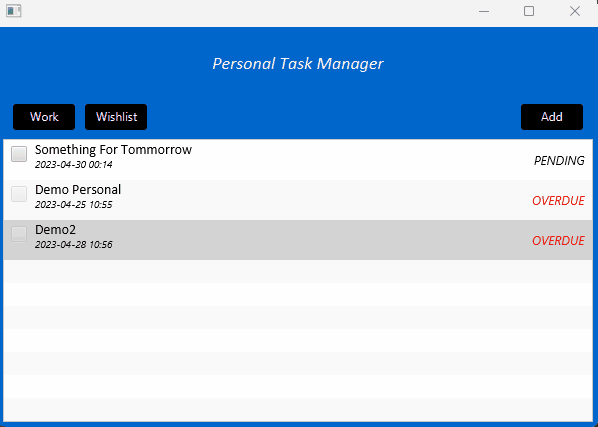

# To Do List Desktop App

This is a simple To Do List Desktop App built using JavaFX and MongoDB database. It allows users to add, edit and delete tasks for their Personal, Work and Wish-list categories.



## Features

- User can create a new task for their Personal, Work or Wish-list categories.
- User can edit an existing task.
- User can delete a task.
- User can mark a task as completed.
- User can view all tasks.
- System will mark tasks as Overdue and disable the completed checkbox, if task past deadline while pending

## Requirments

- Java 8 or later
- MongoDB Java Driver Sync 4.0 or later
- JavaFx 20.0 or later

## Getting Started

1. Clone this repository.
   ```
   git clone https://github.com/Haileab-TG/ToDoListJavaApp.git
   ```
2. Navigate to the project directory.
   ```
   cd todo-list-app
   ```
3. Run the following command to build the project.
   - Download the requirements listed above
4. Navigate to Start.java file in the UI package
   ```
   cd src/UI
   ```

## Usage

- To create a new task, navigate to the appropriate catagory by clicking one of the buttons on top left side
- Then click on the `Add` button and fill in the task details.
- To edit a task, select the task from the list, fill the updates and click on the `Update` button.
- To delete a task, select the task from the list and click on the `Delete` button.
- To mark a task as completed, check the check-box on the left side of each task

## Built With

- JavaFX - GUI Framework
- MongoDB - NoSQL Database
- Scene Builder - JavaFx GUI fxml file generator
